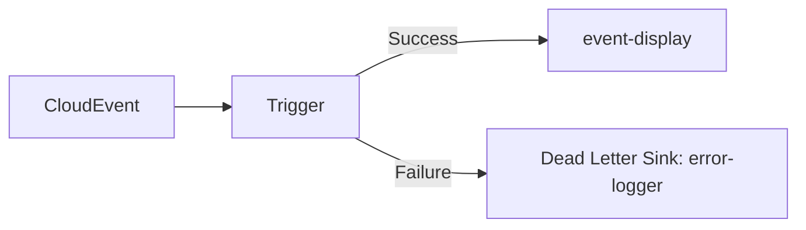

# ✅ ① Dead Letter Sink（DLS）：失敗時のルーティング

- [✅ ① Dead Letter Sink（DLS）：失敗時のルーティング](#--dead-letter-sinkdls失敗時のルーティング)
  - [💡 概要](#-概要)
  - [📦 Trigger に指定する構成例（DeliverySpec）](#-trigger-に指定する構成例deliveryspec)

## 💡 概要

イベントの配信に失敗したとき、別の Service や Sink にルーティングする仕組みです。

## 📦 Trigger に指定する構成例（DeliverySpec）

```yaml
apiVersion: eventing.knative.dev/v1
kind: Trigger
metadata:
  name: trigger-with-dls
spec:
  broker: default
  filter:
    attributes:
      type: dev.knative.sources.ping
  subscriber:
    ref:
      apiVersion: serving.knative.dev/v1
      kind: Service
      name: event-display
  delivery:
    deadLetterSink:
      ref:
        apiVersion: serving.knative.dev/v1
        kind: Service
        name: error-logger
```

- event-display への配信に失敗したら
- error-logger に CloudEvent が飛ぶ


