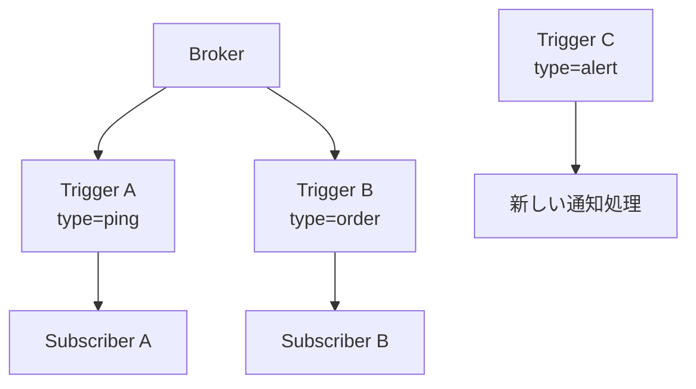
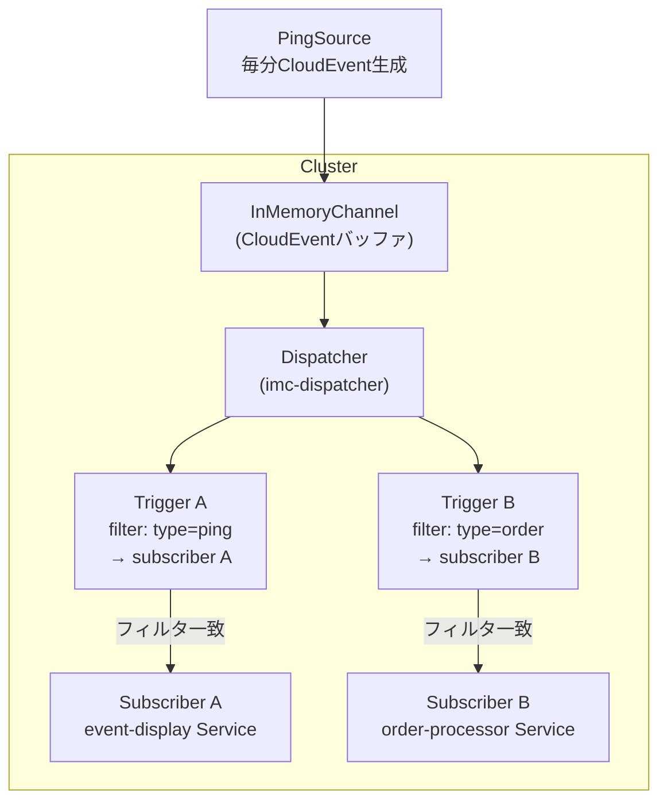
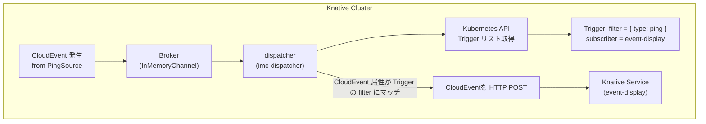

# Dispatcher

- [Dispatcher](#dispatcher)

```markdown
Channel 実装（例: InMemoryChannel）ごとに:

┌──────────────────────┐
│ 1つの dispatcher Pod │───→ Trigger を参照 → subscriber に配信
└──────────────────────┘
```

- 複数の Channel（CR）や Broker を処理していても、dispatcher は1つで全監視
- imc-dispatcher は全 InMemoryChannel のイベントを監視して処理します

| 目的               | どこに実装する？                | 説明                                               |
| ---------------- | ----------------------- | ------------------------------------------------ |
| イベント種別ごとに処理を変えたい | **Trigger** を追加         | `filter.attributes` で分岐。Subscriber をそれぞれ分ける      |
| 処理内容を変えたい        | **Subscriber（Service）** | Knative Service で好きなロジックを書く（Go/Python/Node.jsなど） |
| エラーハンドリングをしたい    | **DeliverySpec / DLQ**  | Trigger に `delivery.deadLetterSink` を追加          |
| 配信先を動的に切り替えたい    | **Trigger を動的に生成/削除**   | 条件に応じて Trigger を生成するControllerを作るなども可            |
| イベントを改変して転送したい   | **中継Serviceを挟む**        | 変換用の KnService を挟んで、Broker に再投稿する構成も可能           |



---





```markdown
[PingSource]
     |
     v
[InMemoryChannel (Broker)]
     |
     v
[Dispatcher (imc-dispatcher)]
     |
     |-- Trigger A: type=ping ----> [Subscriber A]
     |
     |-- Trigger B: type=order ---> [Subscriber B]
```
