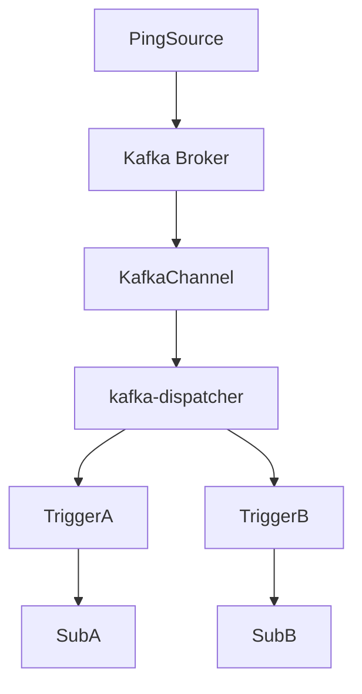

# ✅ ② KafkaChannel への切り替え

- [✅ ② KafkaChannel への切り替え](#--kafkachannel-への切り替え)
  - [💡 概要](#-概要)
  - [📦 KafkaChannel を使う Broker 作成例](#-kafkachannel-を使う-broker-作成例)

## 💡 概要

InMemoryChannel の代わりに KafkaChannel を使うことで、永続性・分散性・スケーラビリティが向上します。

## 📦 KafkaChannel を使う Broker 作成例

```yaml
apiVersion: eventing.knative.dev/v1
kind: Broker
metadata:
  name: kafka-broker
  annotations:
    eventing.knative.dev/broker.class: MTChannelBasedBroker
spec:
  config:
    apiVersion: v1
    kind: ConfigMap
    name: kafka-channel-config
    namespace: knative-eventing
```

- kafka-channel-config は Kafka の接続設定を定義
- Kafka に CloudEvent が書き込まれ、kafka-dispatcher が配信


