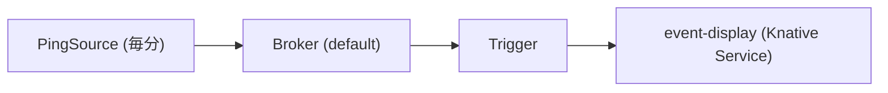
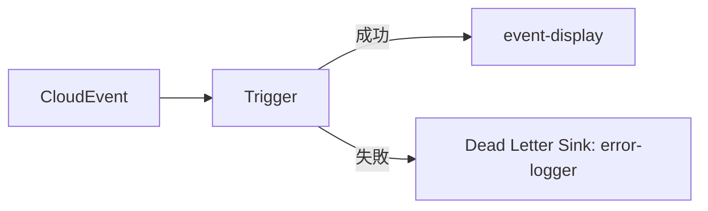
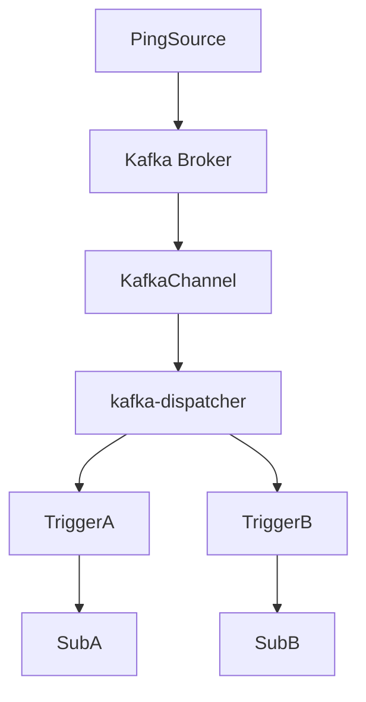

# Knative Eventing の例

このディレクトリには、Knative Eventing コンポーネントの例とサンプル設定が含まれています。

## サンプルシナリオ

### 基本的なイベントフロー

Knative Eventing における基本的なイベントフローは以下で構成されます：

1. イベントを生成するイベントソース
2. イベントを受信してバッファリングする Broker
3. 属性に基づいてイベントをフィルタリングする Trigger
4. 一致するイベントを処理するサブスクライバー



### デッドレターシンクを持つイベントフロー



### Kafka チャネルを使用したイベントフロー



## 独自の例の作成

独自の例を作成するには、様々な Knative Eventing コンポーネントを組み合わせることができます：

1. イベントソース（PingSource、KafkaSource など）を作成
2. イベントを受信する Broker を作成
3. イベントを処理するサブスクライバーサービスを作成
4. Broker とサブスクライバーを接続する Trigger を作成

## 例：完全なイベントフロー

```yaml
# Broker の作成
apiVersion: eventing.knative.dev/v1
kind: Broker
metadata:
  name: default
---
# PingSource の作成
apiVersion: sources.knative.dev/v1
kind: PingSource
metadata:
  name: test-ping
spec:
  schedule: "*/1 * * * *"
  data: '{"message": "Hello from PingSource!"}'
  sink:
    ref:
      apiVersion: eventing.knative.dev/v1
      kind: Broker
      name: default
---
# サブスクライバーサービスの作成
apiVersion: serving.knative.dev/v1
kind: Service
metadata:
  name: event-display
spec:
  template:
    spec:
      containers:
      - image: gcr.io/knative-releases/knative.dev/eventing/cmd/event_display
---
# Trigger の作成
apiVersion: eventing.knative.dev/v1
kind: Trigger
metadata:
  name: ping-trigger
spec:
  broker: default
  filter:
    attributes:
      type: dev.knative.sources.ping
  subscriber:
    ref:
      apiVersion: serving.knative.dev/v1
      kind: Service
      name: event-display
```

## 追加リソース

- [Knative Eventing サンプル](https://knative.dev/docs/eventing/samples/)
- [Knative Eventing チュートリアル](https://knative.dev/docs/eventing/getting-started/)
